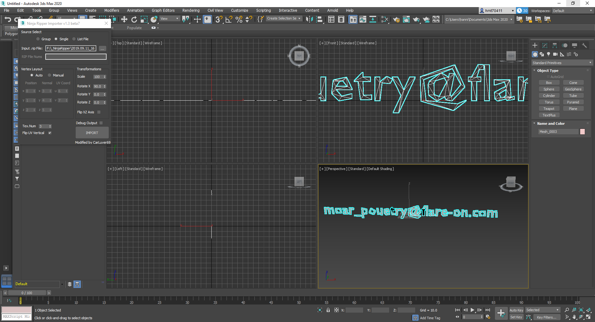

# Flare-on 2019 [2019-08-16 - 2019-09-27]

The information of flare-on can be found [here](https://www.fireeye.com/blog/threat-research/2019/07/announcing-the-sixth-annual-flare-on-challenge.html)

## 1. Memecat Battlestation
### 1.1 Stage 1
* Weapon code: RAINBOW

### 1.2 Stage 2
```python
#!/urs/bin/env python

key = ['\u0003', ' ', '&', '$', '-', '\u001e', '\u0002', ' ', '/', '/', '.', '/']

print('Weapon Code:', '.join([chr(ord(char) ^ ord('A')) for char in key]))
```
* Weapon code: Bagel_Cannon
* Flag: Kitteh_save_galixy@flare-on.com

## 2. Overlong

```shell
$ rabin2 -z Overlong.exe
[Strings]
Num Paddr      Vaddr      Len Size Section  Type  String
000 0x00000808 0x00402008  68 176 (.rdata)  utf8 I never broke the encoding: I_a_M_t_h_e_e_n_C_o_D_i_n_g@flare-on.com
001 0x000008ea 0x004020ea  11  12 (.rdata) ascii MessageBoxA
002 0x000008f6 0x004020f6  10  11 (.rdata) ascii USER32.dll
000 0x00000a00 0x00403000   6   7 (.data) ascii Output
```

* Flag: I_a_M_t_h_e_e_n_C_o_D_i_n_g@flare-on.com

## 3. Flarebear
Firstly, use [dex2jar](https://github.com/pxb1988/dex2jar) to decompile the apk file to jar file.
```shell
$ d2j-dex2jar -f flarebear.apk
```
Use [jd-gui](https://github.com/java-decompiler/jd-gui) to open created `*.jar` file, we have:
```java
public final class FlareBearActivityKt
{
  private static final int CLEAN_PER_CLEAN = 6;
  private static final int CLEAN_PER_FEED = -1;
  private static final int CLEAN_PER_PLAY = -1;
  private static final int HAPPY_PER_CLEAN = -1;
  private static final int HAPPY_PER_FEED = 2;
  private static final int HAPPY_PER_PLAY = 4;
  private static final String IV = "pawsitive_vibes!";
  private static final int MASS_PER_CLEAN = 0;
  private static final int MASS_PER_FEED = 10;
  private static final int MASS_PER_PLAY = -2;
  private static final float POOS_PER_FEED = 0.34F;
  private static final String SALT = "NaClNaClNaCl";
  private static final String TAG = "FLARE Bear";
  private static List<ImageView> poosList = (List)new ArrayList();
}

public final boolean isEcstatic()
  {
    boolean bool1 = false;
    int i = getState("mass", 0);
    int j = getState("happy", 0);
    int k = getState("clean", 0);
    boolean bool2 = bool1;
    if (i == 72)
    {
      bool2 = bool1;
      if (j == 30)
      {
        bool2 = bool1;
        if (k == 0) {
          bool2 = true;
        }
      }
    }
    return bool2;
  }

  public final boolean isHappy()
  {
    int i = getStat('f');
    int j = getStat('p');
    double d = i / j;
    boolean bool;
    if ((d >= 2.0D) && (d <= 2.5D)) {
      bool = true;
    } else {
      bool = false;
    }
    return bool;
  }

  public final void setMood()
  {
    if (isHappy())
    {
      ((ImageView)_$_findCachedViewById(R.id.flareBearImageView)).setTag("happy");
      if (isEcstatic()) {
        danceWithFlag();
      }
    }
    else
    {
      ((ImageView)_$_findCachedViewById(R.id.flareBearImageView)).setTag("sad");
    }
  }

  public final void feed(@NotNull View paramView)
  {
    Intrinsics.checkParameterIsNotNull(paramView, "view");
    saveActivity("f");
    changeMass(10);
    changeHappy(2);
    changeClean(-1);
    incrementPooCount();
    feedUi();
  }

  public final void play(@NotNull View paramView)
  {
    Intrinsics.checkParameterIsNotNull(paramView, "view");
    saveActivity("p");
    changeMass(-2);
    changeHappy(4);
    changeClean(-1);
    playUi();
  }

  public final void clean(@NotNull View paramView)
  {
    Intrinsics.checkParameterIsNotNull(paramView, "view");
    saveActivity("c");
    removePoo();
    cleanUi();
    changeMass(0);
    changeHappy(-1);
    changeClean(6);
    setMood();
  }
```

Start the app and tap 8 feeds => 4 plays => 2 cleans 

* Flag: th4t_was_be4rly_a_chall3nge@flare-on.com

Note: How to patch the apk file:
We use [apktool](https://github.com/iBotPeaches/Apktool) to decode `flarebear.apk` file:
```shell
$ apktool d flarebear.apk
```

Open `flarebare/smali/com/fireeye/flarebear/FlareBearActivity.smali` in text editor. Then overwrite the `isEcstatic` and `isHappy` method, so that they always return `0x1`.

```shell
$ apktool b flarebear
$ cd flarebear/dist
$ keytool -genkey -keystore flarebear.keystore -validity 1000 -alias bear
$ jarsigner -keystore flarebear.keystore -verbose flarebear.apk bear
```
## 4. Dnschess

```shell
$ r2 -A ChessAI.so 
[x] Analyze all flags starting with sym. and entry0 (aa)
[x] Analyze function calls (aac)
[x] Analyze len bytes of instructions for references (aar)
[x] Constructing a function name for fcn.* and sym.func.* functions (aan)
[x] Type matching analysis for all functions (aaft)
[x] Use -AA or aaaa to perform additional experimental analysis.
[0x00001090]> afl~getNextMove
0x000011c1   13 479          sym.getNextMove
[0x00001090]> s sym.getNextMove
[0x000011c1]> pdf
```
Note: Use `VV` mode to see the structure and algorithm. Pay attention to the funtion `sym.imp.gethostbyname`

```shell
$ sudo apt install dnsmasq -y # install dnsmasq

$ tshark -r capture.pcap > capture.txt

$ cat capture.txt | grep response | sed -r 's/(^[^A]*)(A )([^ ]*)( A )([0-9.]*)([^$]*)/address=\/\3\/\5/g' | sort > addresses.txt

$ sudo cat addresses.txt >> /etc/dnsmasq.conf
```

Open `/etc/dnsmasq.conf` file and uncomment the following lines:

```shell
domain-needed
bogus-priv
no-resolv
no-poll
server=8.8.8.8
server=208.67.220.220
```
Then start `dnsmasq`

```shell
$ sudo service dnsmasq start
$ sudo service dnsmasq stop
$ sudo service dnsmasq restart
```

Open `/etc/resolv.conf` and change the nameserver to localhost as below:
```shell
nameserver 127.0.0.1
```

Create a file name `sol.py` with content as below:
```python
#!/usr/bin/env python

steps = []
with open('addresses.txt', 'r') as file:
  for line in file.readlines():
    arr = line.strip().split('/')
    ip = arr[2].split('.')
    if (ip[0] == '127' and int(ip[3]) % 2 == 0):
      order = ("%0.2X" % int(ip[2]))[-1]
      steps.append({
        'move': arr[1].replace('.game-of-thrones.flare-on.com', ''),
        'order': order
      })

steps = sorted(steps, key=lambda step: step['order'])  
print('\n--:[ DNS-CHESS SOLUTION ]:--')
for step in steps:
  print('[+] %s %s' % (step['order'], step['move'])
```

In terminal, run
```shell
$ chmod +x sol.py
$ ./sol.py

--:[ DNS-CHESS SOLUTION ]:--
[+] 0 pawn-d2-d4
[+] 1 pawn-c2-c4
[+] 2 knight-b1-c3
[+] 3 pawn-e2-e4
[+] 4 knight-g1-f3
[+] 5 bishop-c1-f4
[+] 6 bishop-f1-e2
[+] 7 bishop-e2-f3
[+] 8 bishop-f4-g3
[+] 9 pawn-e4-e5
[+] A bishop-f3-c6
[+] B bishop-c6-a8
[+] C pawn-e5-e6
[+] D queen-d1-h5
[+] E queen-h5-f7

$ chmod +x ChessUI
$ ./ChessUI
```

* Flag: LooksLikeYouLockedUpTheLookupZ@flare-on.com

## 5. Demo

* On windows guest, run `demo.exe`, a pop-up shows an error: `d3dx9_43 is required`.
* Download and install [directx 9](https://www.microsoft.com/en-us/download/details.aspx?id=35), then run the executable file again. The Flare logo is displayed in the demo window.
* Use `strings` to extract strings from the exe file. There is nothing interesting => The PE file is packed or obfuscated.

* Use [Ninjaripper](https://gamebanana.com/tools/5638) to extract 3D models and assests from the demo app. After running ninjaripper, browse to demo.exe file, then click `run` => Press `F10` to capture the object. The results will be stored in default output folder. These output files named `Mesh_xxxx.rip`.

* Use [3DS Max](https://www.autodesk.com/products/3ds-max/overview) to open the `*.rip` files. In 3DS Max, go to `Scripting` > `Run Script` > Navigate to `ninjaripper/tools/3ds_max_scripts/importer_script.ms`. Then open `*.rip` file.



* Flag: moar_pouetry@flare-on.com

## 6. Bmphide

* Use `dnSpy` to debug `bmphide.exe`. However, the debugger is stopped unexpectedly due to `Stack overflow exception`. We need to NOP out the instruction below in the `Program.Init` method:

```
	/* 0x000025DA 2804000006   */ IL_0066: call      void BMPHIDE.A::CalculateStack()
```

* After NOP-ing, save the file and re-open the patched executable in `dnSpy`.

* While debugging, we will find that at runtime, the methods `Program.a` and `Program.c` are switched to `Program.b` and `Program.d` respectively. The `bmphide.exe` does 2 things:
  * Encrypt the data via `Program.h` method
  * Hide the encrypted data into `*.bmp` file via `Program.i` method

* Based on method `Program.i`, we can write the `extractEncryptedData` method as follow:
```c#
public static byte[] extractEncryptedData(Bitmap bm)
{
  byte[] extractedData = new byte[bm.Width * bm.Height];
  int num = 0;
  for (int i = 0; i < bm.Width; i++)
  {
    for (int j = 0; j < bm.Height; j++)
    {
      Color pixel = bm.GetPixel(i, j);
      int right = pixel.R & 0x7;
      int middle = (pixel.G & 0x7) << 3;
      int left = (pixel.B & 0x3) << 6;
      byte extractedByte = (byte)(left | middle | right);
      extractedData[num] = extractedByte;
      num += 1;
    }
  }
  return extractedData;
}
```

* And the `bruteForce` method as below:

```c#
public static byte[] bruteForce(byte[] encryptedData)
{
  byte[] result = new byte[encryptedData.Length];
  int num = 0;
  int finished = 0;
  for (int i = 0; i < encryptedData.Length; i++)
  {
    int num3 = f(num);
    int num6 = f(num + 1);
    for (int guess = 0; guess <= 255; guess++)
    {
      int num4 = guess;
      num4 = e((byte)num4, (byte)num3);
      num4 = a((byte)num4, 7);
      num4 = e((byte)num4, (byte)num6);
      num4 = c((byte)num4, 3);
      if (((byte)num4) == encryptedData[i])
      {
        result[i] = (byte)guess;
        finished++;
        break;
      }
    }
    num += 2;
  }
  return result;
}
```

* The body of `Program.a` and `Program.c` should be replaced as follow:
```c#
public static byte a(byte b, int r)
{
  for (int i = 0; i < r; i++)
  {
    byte b2 = (byte)((b & 0x80) / 128);
    b = (byte)(((b * 2) & 0xFF) + b2);
  }
  return b;
}

public static byte c(byte b, int r)
{
  for (int i = 0; i < r; i++)
  {
    byte b2 = (byte)((b & 1) * 128);
    b = (byte)((((int)b / 2) & 0xFF) + b2);
  }
  return b;
}
```

* And the `main` method:

```c#
public static int yy = 20;
public static string ww = "1F7D";
public static string zz = "MTgwMw==";

static void Main(string[] args)
{
  Program.yy *= 136;
  Program.ww += "14";
  Program.ww += "82";
  Program.zz = "MzQxOTk=";
  Program.yy += 18;

  string encryptedFilePath = Path.GetFullPath(args[0]);
  string decryptedFileName = args[1];
  Bitmap encryptedBitmap = new Bitmap(encryptedFilePath);
  byte[] encryptedData = Program.extractEncryptedData(encryptedBitmap);

  byte[] decryptedData = Program.bruteForce(encryptedData);
  File.WriteAllBytes(decryptedFileName, decryptedData);
}
```

* However, bruteforcing the `image.bmp` only gives the gibberish. Going back to `dnSpy`, there is a JIT hook in the application. For more details please read this [article](https://xoofx.com/blog/2018/04/12/writing-managed-jit-in-csharp-with-coreclr/).

* Take closer look into `A.IncrementMaxStack`:
```c#
private unsafe static uint IncrementMaxStack(IntPtr self, A.ICorJitInfo* comp, A.CORINFO_METHOD_INFO* info, uint flags, byte** nativeEntry, uint* nativeSizeOfCode)
{
	bool flag = info != null;
	if (flag)
	{
		MethodBase methodBase = A.c(info->ftn);
		bool flag2 = methodBase != null;
		if (flag2)
		{
			bool flag3 = methodBase.MetadataToken == 100663317; // method h
			if (flag3)
			{
				uint flNewProtect;
				A.VirtualProtect((IntPtr)((void*)info->ILCode), info->ILCodeSize, 4u, out flNewProtect);
				Marshal.WriteByte((IntPtr)((void*)info->ILCode), 23, 20); // replace method f (0x13) with g (0x14)
				Marshal.WriteByte((IntPtr)((void*)info->ILCode), 62, 20); // replace method f (0x13) with g (0x14)
				A.VirtualProtect((IntPtr)((void*)info->ILCode), info->ILCodeSize, flNewProtect, out flNewProtect);
			}
			else
			{
				bool flag4 = methodBase.MetadataToken == 100663316; // method g
				if (flag4)
				{
					uint flNewProtect2;
					A.VirtualProtect((IntPtr)((void*)info->ILCode), info->ILCodeSize, 4u, out flNewProtect2);
					Marshal.WriteInt32((IntPtr)((void*)info->ILCode), 6, 309030853); // replace -306674912 with 309030853
					Marshal.WriteInt32((IntPtr)((void*)info->ILCode), 18, 209897853); // replace 1669101435 with 209897853
					A.VirtualProtect((IntPtr)((void*)info->ILCode), info->ILCodeSize, flNewProtect2, out flNewProtect2);
				}
			}
		}
	}
	return A.originalDelegate(self, comp, info, flags, nativeEntry, nativeSizeOfCode);
}
```

* So the method `Program.g` should be rewritten as follow:
```c#
public static byte g(int idx)
{
  byte b = (byte)((idx + 1) * 309030853u);
byte k = (byte)((idx + 2) * 209897853);
            return e(b, k);
        }
```

And the `Program.h` should be:
```c#
public static byte[] h(byte[] data)
{
  byte[] array = new byte[data.Length];
  int num = 0;
  for (int i = 0; i < data.Length; i++)
  {
    int num3 = g(num++);
    int num4 = data[i];
    num4 = e((byte)num4, (byte)num3);
    num4 = a((byte)num4, 7);
    int num6 = g(num++);
    num4 = e((byte)num4, (byte)num6);
    num4 = c((byte)num4, 3);
    array[i] = (byte)num4;
  }
  return array;
}
```

And the `decryptData` method:

```c#
public static byte da(byte eb, int r)
{
  for (int i = 0; i < r; i++)
  {
    eb = (byte)(((eb & 1) == 0) ? (eb >> 1) : ((eb >> 1) | 0x80));
  }
  return eb;
}

public static byte dc(byte eb, int r)
{
  for (int i = 0; i < r; i++)
  {
    if (eb >= 128)
    {
      eb = (byte)((eb - 128) * 2 + 1);
    }
    else
    {
      eb = (byte)((eb << 1) & 0xFF);
    }
  }
  return eb;
}

public static byte de(byte eb, byte k)
{
  return (byte)(eb ^ k);
}

public static byte[] decryptData(byte[] encryptedData, int n)
{
  Console.WriteLine("Decrypting...");
  if (n <= 0 || n > encryptedData.Length)
  {
    n = encryptedData.Length;
  }
   
  byte[] decryptedData = new byte[n];
  int num = 0;
  for (int i = 0; i < n; i++)
  {
    int data = dc(encryptedData[i], 3);
    int num1 = g(num + 1);
    data = de((byte)data, (byte)num1);
    data = da((byte)data, 7);
    int num0 = g(num);
    data = de((byte)data, (byte)num0);
    decryptedData[i] = (byte)data;
    num += 2;
  }
  return decryptedData;
}
```

The `bmpunhide.cs` can be found [here](./assets/bmpunhide.cs) and the compiled `bmpunhide.exe` [here](./assets/bmpunhide.exe).

* You need to run `bmpunhide` twice to get the flag.
```shell
$ bmpunhide.exe image.bmp flag1.bmp
$ bmpunhide.exe flag1.bmp flag.bmp
```

* Flag: d0nT_tRu$t_vEr1fy@flare-on.com

## 7. Wopr

* Monitoring the `wopr.exe` process by using `procmon` and `procexe`, we can find that Python3.7 is loaded to interpret the code. Thus, the `wopr.exe` is definitely a wrapper for a Python script. There are 2 popular tools used to convert python script into executable file are `py2exe` and `pyinstaller`.

* Use [pyinstxtractor.py](https://sourceforge.net/projects/pyinstallerextractor/) to extract python bytecode from the exe file.
```shell
$ python.exe pyinstxtractor.py wopr.exe
```

* In the `wopr.exe_extracted` directory, we can confirm that the file `pyiboot02_cleanup` is the main script because normally the `pyinstaller` does not generate this file name. Use HexEditor to inspect this file, we find that there is no magic number part. So use the [prepend_magic_number.py](./assets/wopr/prepend_magic_number.py) script to generate the `*.pyc` for this file:
```shell
$ python prepend_magic_number.py pyiboot02_cleanup
```

* Use [decompyle3](https://github.com/rocky/python-decompile3) to decompile `*.pyc` to original python script:
```shell
$ decompyle3.exe -o . pyiboot02_cleanup.pyc
# The output file is named pyiboot02_cleanup.py
```

* By reading the `pyiboot02_cleanup.py`, we can see that:
  * It swaps the builtin method `print` and `exec` with each other
  * It extracts the `space` (' ') and `tab` ('\t') characters in the docstring `__doc__` to generate a real python script. Unfortunately, the `tab` characters in `__doc__` string are replaced by `space`s when we decompile the `*.pyc` file using `decompyle3`. That is also the reason we cannot run the script after decompiling. To fix this, open the `pyiboot02_cleanup.pyc` in text editor and copy all the docstring section to the `pyiboot02_cleanup.py`. Now we can execute the script.

* Modify the script to save the decompressed code to `wopr.py` file, instead of execute them.

```python
def save_real_code(decompressedData, filename):
    with open(filename, 'wb') as output_file:
        output_file.write(decompressedData)
    exec('[+] Decompressed code has been saved to "%s"' % filename)
    # Note that the exec and print methods are swapped

for i in range(256):
    try:
        # print(lzma.decompress(fire(eye(__doc__.encode()), bytes([i]) + BOUNCE)))
        save_real_code(lzma.decompress(fire(eye(__doc__.encode()), bytes([i]) + BOUNCE)), 'wopr.py')

    except Exception:
        pass
```

* The modified `pyiboot02_cleanup.py` file can be found [here](./assets/wopr/pyiboot02_cleanup.py).

```shell
$ python3.exe pyiboot02_cleanup.py
LOADING...
[+] Decompressed code has been saved to "wopr.py"
```

* Run [extract_launch_code.py](./assets/wopr/extract_launch_code.py) to get the launch code:
```shell
$ python3.exe extract_launch_code.py
[+] Launch code for WOPR: 5C0G7TY2LWI2YXMB
```

* To understand how write the `extract_launch_code.py` please see the `wrong()` function and [The portable executable file format from top to bottom](http://www.csn.ul.ie/~caolan/pub/winresdump/winresdump/doc/pefile2.html)

* Flag: L1n34R_4L93bR4_i5_FuN@flare-on.com


